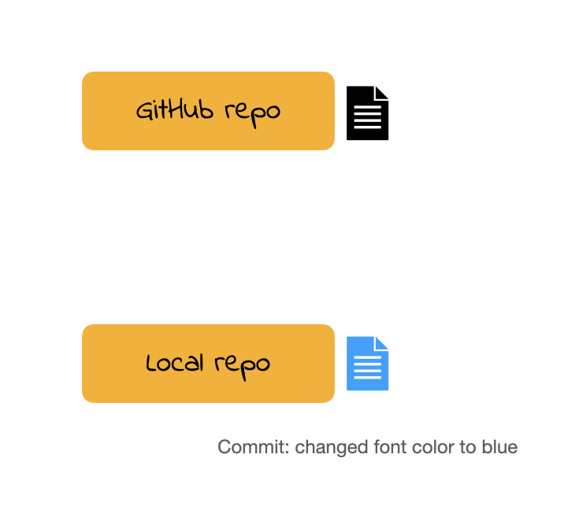

```{r}
#| echo: false
library(tidyverse)
library(here)

```

## Loading packages

In a single Quarto document we may use several packages.

We should always load our packages in a chunk all together at the top of the document to make it clear what packages the document relies on.

## Session info

It is also a good practice to save session information as package versions change, in order to be able to reproduce results from an analysis we need to know under what technical conditions the analysis was conducted.

```{r}
#| echo: true
sessionInfo()
```


# Importing and exporting data

## Importing .csv Data 


```{r}
#| echo: true
#| eval: false
my_data <- readr::read_csv("dataset.csv")
```

. . .

This is what we primarily use in this class.

We have to tell `read_csv()` the name of the data file.


## Importing Excel Data

```{r}
#| echo: true
#| eval: false
my_data <- readxl::read_excel("dataset.xlsx")
```


## Importing Excel Data

```{r}
#| echo: true
#| eval: false
my_data <- readxl::read_excel("dataset.xlsx", sheet = 2)
```


## Importing SAS, SPSS, Stata Data

```{r}
#| echo: true
#| eval: false
library(haven)
# SAS
my_data <- read_sas("dataset.sas7bdat")
# SPSS
my_data <- read_sav("dataset.sav")
# Stata
my_data <- read_dta("dataset.dta")
```


## Where is the dataset file?

Importing data will depend on where the dataset is on your computer or online.

If we only provide `read_csv()` with the name of the data file, the data must be saved in the same location as the Quarto document.


## Where is the dataset file? Online


Up to this point we have only been using data from packages or reading in data from online.

Recall the data from lab 1a read in from a url
```{r}
#| message: false
baby_names <- read_csv("http://csuci-data200.github.io/lectures/week-01/data/california-popular-baby-names.csv")
```


## Where is the dataset file? Local

If the data is saved within another folder locally, we need to provide the path to the data. 

If we had data saved in a folder named `data` we could write

```{r}
#| echo: true
#| eval: false
my_data <- read_csv(here("data/dataset.csv"))
```

. . .

We use the help of `here()` function from the `here` library. 
This function sets the working directory (aka location the path starts from) to the project folder (i.e. where the `.Rproj` file is).

## Exporting data as a csv

Say we cleaned our data and wanted to save it locally
```{r}
#| eval: false
write_csv(baby_names, file = "baby-names.csv")
```

. . .

If I wanted to save it within a folder called `data` I could write
```{r}
#| eval: false
write_csv(baby_names, file = here("data/baby-names.csv"))
```

## Naming files

::: {.nonincremental}

Three principles of naming files 

- machine readable
- human readable
- plays well with default ordering (e.g. alphabetical and numerical ordering)

<!-- (Jenny Bryan) -->

For the purposes of this course an additional principle is that file names follow

- tidyverse style (all lower case letters, words separated by HYPHEN)

:::


# Version Control

##

::: {.incremental}

Does this look familiar?

- hw1

- hw1_final

- hw1_final2

- hw1_final3

- hw1_finalwithfinalimages

- hw1_finalestfinal

:::


##

::: {.incremental}

What if we tracked our file with better names for each version and have only 1 file **hw1**?


- hw1 ***added questions 1 through 5***

- hw1 ***changed question 1 image***

- hw1 ***fixed typos***


We will call the descriptions in italic **commit** messages.

:::


## git vs. GitHub

- git allows us to keep track of different versions of a file(s).

- GitHub is a website where we can store (and share) different versions of the files. 

##

```{r}
#| out.width: '40%'
#| fig.align: 'center' 
#| echo: false
knitr::include_graphics('img/github-illustration.002.jpeg')
```

##

```{r}
#| out.width: '55%'
#| fig.align: 'center'
#| echo: false
knitr::include_graphics('img/github-illustration.003.jpeg')
```

##

```{r}
#| out.width: '55%'
#| fig.align: 'center'
#| echo: false

```

##

```{r}
#| out.width: '55%'
#| fig.align: 'center'
#| echo: false
knitr::include_graphics('img/github-illustration.005.jpeg')
```

##

```{r}
#| out.width: '55%'
#| fig.align: 'center'
#| echo: false
knitr::include_graphics('img/github-illustration.006.jpeg')
```

##

```{r}
#| out.width: '55%'
#| fig.align: 'center'
#| echo: false
knitr::include_graphics('img/github-illustration.007.jpeg')
```

## Demo <https://github.com/csuci-data200/lectures>

<center>

<video width="80%" height="45%%" align = "center" controls>
  <source src="screencast/github-intro-screencast.mp4" type="video/mp4">
</video>

</center>

:::


## Cloning a repo

**repo** is a short form of repository. Repositories contain all of your project's files as well as each file's revision history.

To **clone** a GitHub repo to our computer, we first copy the cloning link as shown in demo then start an RStudio project using that link.  

**Cloning** a repo pulls (downloads) all the elements of a repo available at that specific time. 


## Commits

Once you make changes to your repo (e.g. take notes during lecture, answer an activity question) you can take a snapshot of your changes with a commit.

This way if you ever have to go back in version history you have your older commits to get back to. 

This is especially useful, for instance, if you want to go back to an earlier solution you have committed.


## Push

All the commits you make will initially be local (i.e. on your own computer). 

In order for us to see your commits and your final submission on any file, you have to **push** your commits. In other words upload your files at the stage in that specific time.


## (An incomplete) Git/GitHub glossary

**Git:** is software for tracking changes in any set of files

**GitHub:** is an internet host for Git projects.

**repo:** is a short form of repository. Repositories contain all of your project's files as well as each file's revision history.

**clone:** Cloning a repo **pulls** (downloads) all the elements of a repo available at that specific time. 

**commit:** A snapshot of your repo at a specific point in time. We distinguish each commit with a **commit message**. 

**push:** Uploads the latest "committed" state of your repo to GitHub.

##

::: {.font150} 

Do you git it?

::: 


## .gitignore

A .gitignore file contains the list of files which Git has been explicitly told to ignore.

For instance README.html can be git ignored.

You may consider git ignoring confidential files (e.g. some datasets) so that they would not be pushed by mistake to GitHub.

## .gitignore

A file can be git ignored either by point-and-click using RStudio's Git pane or by adding the file path to the .gitignore file. For instance weather.csv data file in a data folder need to be added as data/weather.csv

Files with certain files (e.g. all .log files) can also be ignored. See git ignore patterns.
