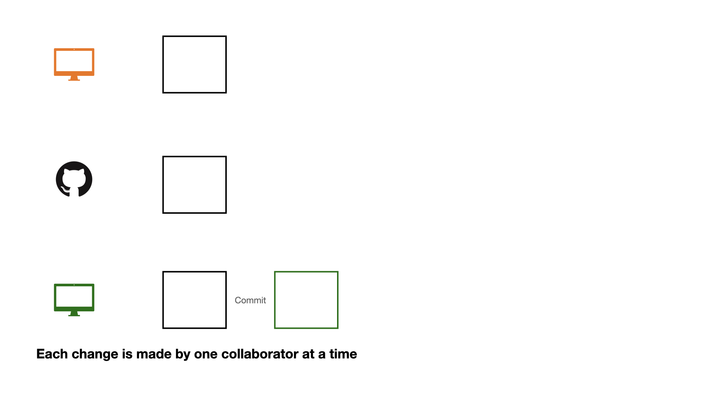
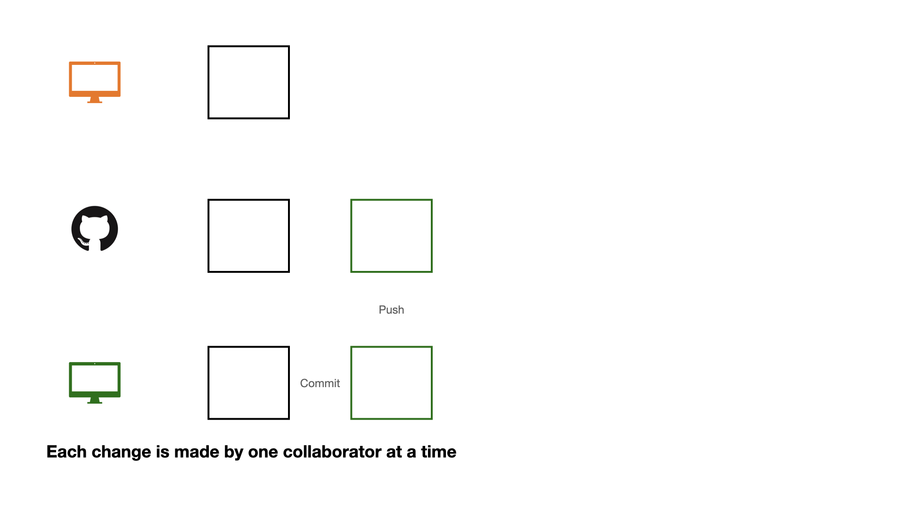
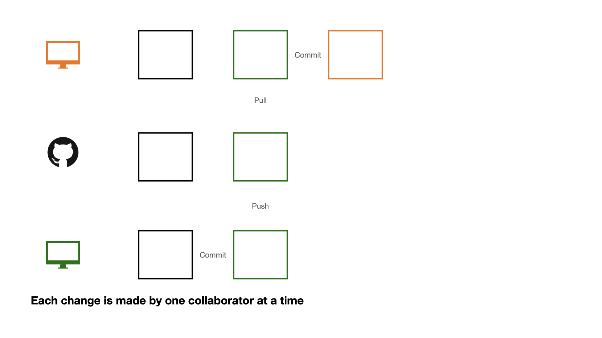
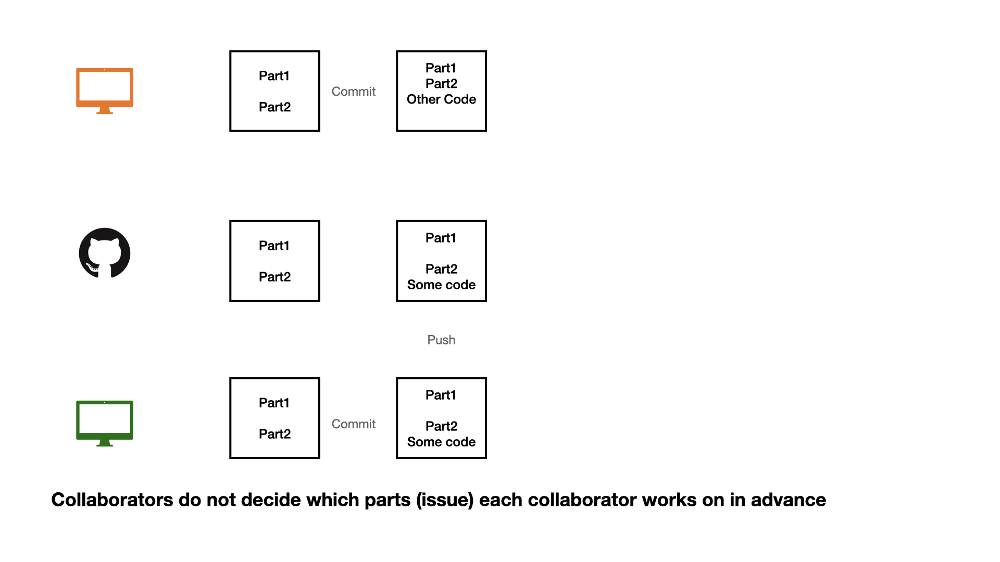
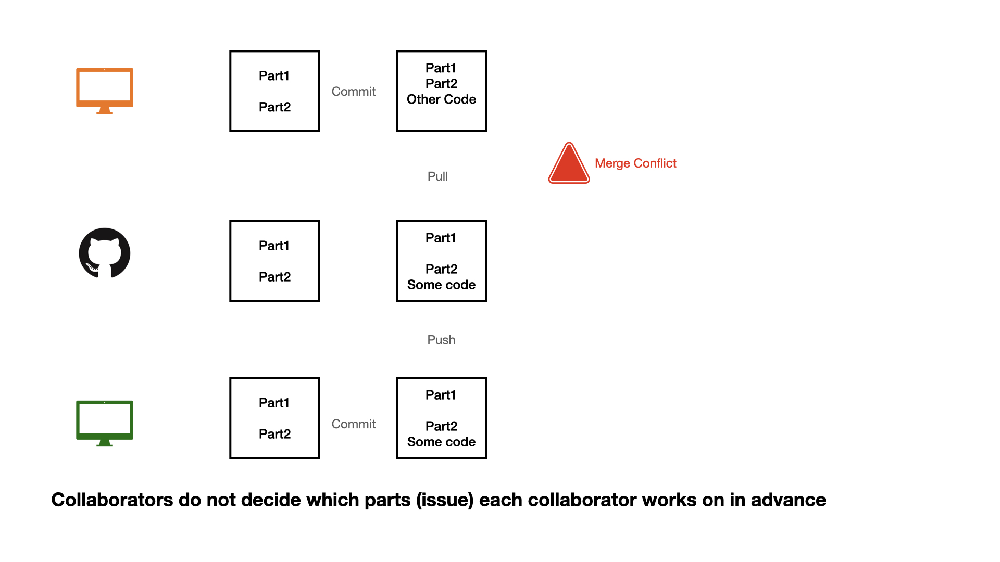
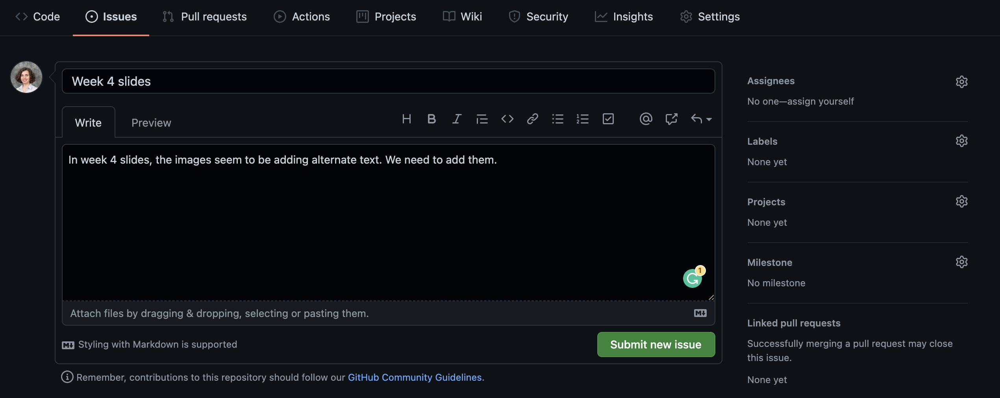

## Naming files

::: {.nonincremental}

Three principles of naming files 

- machine readable
- human readable
- plays well with default ordering (e.g. alphabetical and numerical ordering)

<!-- (Jenny Bryan) -->

For the purposes of this course an additional principle is that file names follow

- tidyverse style (all lower case letters, words separated by HYPHEN)

:::


## Importing .csv Data 


```{r}
#| echo: true
#| eval: false
readr::read_csv("dataset.csv")
```


## Importing Excel Data

```{r}
#| echo: true
#| eval: false
readxl::read_excel("dataset.xlsx")
```


## Importing Excel Data

```{r}
#| echo: true
#| eval: false
readxl::read_excel("dataset.xlsx", sheet = 2)
```


## Importing SAS, SPSS, Stata Data

```{r}
#| echo: true
#| eval: false
library(haven)
# SAS
read_sas("dataset.sas7bdat")
# SPSS
read_sav("dataset.sav")
# Stata
read_dta("dataset.dta")
```


## Where is the dataset file?

Importing data will depend on where the dataset is on your computer. However we use the help of `here::here()` function. 
This function sets the working directory to the project folder (i.e. where the `.Rproj` file is).

```{r}
#| echo: true
#| eval: false
read_csv(here::here("data/dataset.csv"))
```

## Collaboration on GitHub

```{r}
#| echo: false
#| out-width: "90%"

```

## Collaboration on GitHub


```{r}
#| echo: false
#| out-width: "90%"
knitr::include_graphics("img/git-collab.003.jpeg")
```

## Collaboration on GitHub


```{r}
#| echo: false
#| out-width: "90%"

```

## Collaboration on GitHub


```{r}
#| echo: false
#| out-width: "90%"

```

## Collaboration on GitHub


```{r}
#| echo: false
#| out-width: "90%"
knitr::include_graphics("img/git-collab.006.jpeg")
```

## Collaboration on GitHub

```{r}
#| echo: false
#| out-width: "90%"

```

## Collaboration on GitHub


```{r}
#| echo: false
#| out-width: "90%"
knitr::include_graphics("img/git-collab.008.jpeg")
```

## Collaboration on GitHub

If each change is made by one collaborator at a time, this would not be an efficient workflow. 

## Collaboration on GitHub


```{r}
#| echo: false
#| out-width: "90%"
knitr::include_graphics("img/git-collab.009.jpeg")
```

## Collaboration on GitHub


```{r}
#| echo: false
#| out-width: "90%"
knitr::include_graphics("img/git-collab.010.jpeg")
```

## Collaboration on GitHub

```{r}
#| echo: false
#| out-width: "90%"
knitr::include_graphics("img/git-collab.011.jpeg")
```

## Collaboration on GitHub

1 - commit

2 - pull (very important)

3 - push


## Collaboration on GitHub


```{r}
#| echo: false
#| out-width: "90%"

```


## Collaboration on GitHub


```{r}
#| echo: false
#| out-width: "90%"

```


## Collaboration on GitHub


```{r}
#| echo: false
#| out-width: "90%"
knitr::include_graphics("img/git-collab.015.jpeg")
```


## Opening an issue

```{r}
#| echo: false
#| out-width: "90%"

```

We can create an **issue** to keep a list of mistakes to be fixed, ideas to check with teammates, or note a to-do task. You can assign tasks to yourself or teammates. 

## Closing an issue

```{r}
#| echo: false
#| out-width: "90%"
knitr::include_graphics("img/issue-number.png")
```

If you are working on an issue, it makes sense to refer to issue number in your commit message (e.g. "add first draft of alternate texts for #4"). 
If your commit resolves the issue then you can use key words such as "fixes #4" or "closes #4" to close the issue. 
Issues can also be manually closed.

## .gitignore

A .gitignore file contains the list of files which Git has been explicitly told to ignore.

For instance README.html can be git ignored.

You may consider git ignoring confidential files (e.g. some datasets) so that they would not be pushed by mistake to GitHub.

A file can be git ignored either by point-and-click using RStudio's Git pane or by adding the file path to the .gitignore file. For instance weather.csv data file in a data folder need to be added as data/weather.csv

Files with certain files (e.g. all .log files) can also be ignored. See git ignore patterns.

##

It is also a good practice to save session information as package versions change, in order to be able to reproduce results from an analysis we need to know under what technical conditions the analysis was conducted.

```{r}
#| echo: true
sessionInfo()
```


