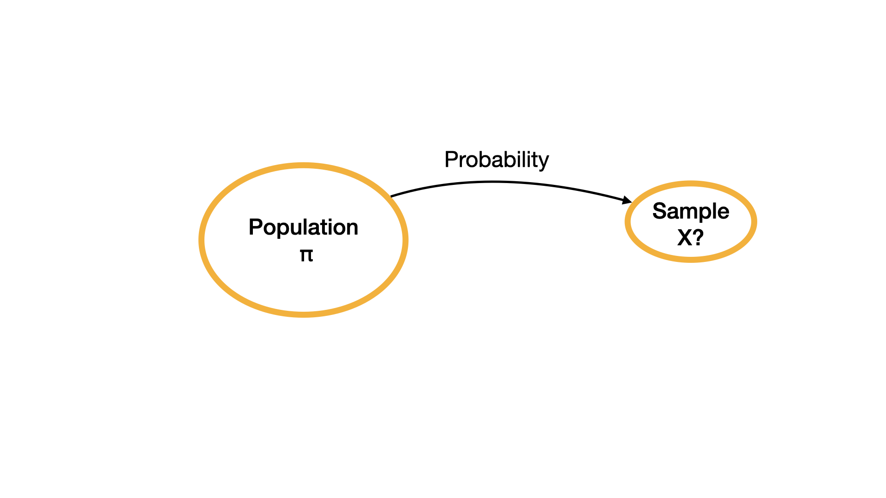
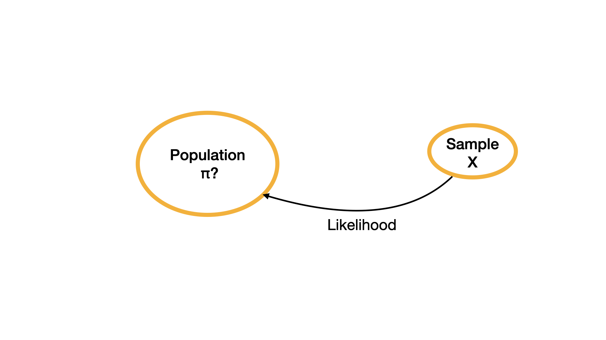

##


```{r}
#| echo: false

library(tidyverse)

theme_set(theme_gray(base_size = 22))
```


```{r}
#| echo: false
plot_beta_prob <- function(value, alpha, beta, direction = "lower"){
  
  data <- data.frame(x = c(0, 1))
  
  p <- ggplot(data = data, aes(x)) +
    stat_function(
      fun = stats::dbeta,
      n = 101,
      args = list(shape1 = alpha, shape2= beta)
    ) +
    labs(
      x = expression(pi),
      y = expression(paste("f(",pi,")"))
    )
  
  if(direction == "lower"){
    
  p <- p +
      stat_function(
        fun = dbeta, 
        args = list(alpha, beta), 
        geom = "area", 
        fill = "#D55E00", 
        alpha = 0.8,
        xlim = c(0, value)
      ) +
    labs(caption = paste0(
      "The area under the curve is ", 
      round(pbeta(value, alpha, beta), digits = 4)*100, "%.", 
      " In other words, P(", "\U03C0", " < ", value, ") = ", 
      round(pbeta(value, alpha, beta), digits = 4),"."
    ))
  }
  
  
  if(direction == "upper"){
    
  p <- p +
      stat_function(
        fun = dbeta, 
        args = list(alpha, beta), 
        geom = "area", 
        fill = "#D55E00", 
        alpha = 0.8, 
        xlim = c(value, 1)
      ) +
    labs(caption = paste0(
      "The area under the curve is ", 
      round(pbeta(value, alpha, beta, lower.tail = FALSE), digits = 4)*100, "%.", 
      " In other words, P(", "\U03C0", " > ", value, ") = ", 
      round(pbeta(value, alpha, beta, lower.tail = FALSE), digits = 4),"."
    ))
  }
  
p

}


plot_normal_prob <- function(value, mean, sd, end = 3, direction = "lower"){
  
  x <- seq(mean - (end * sd) , mean + (end * sd), 0.01)
  
  y <- dnorm(x, mean = mean, sd = sd)
  
  data <- data.frame(x = x, y = y)
  
  p <- ggplot(data = data, aes(x)) +
    stat_function(
      fun = stats::dnorm,
      n = 101,
      args = list(mean = mean, sd= sd)
    ) 
  
  if(direction == "lower"){
    
    p <- p +
      stat_function(
        fun = dnorm, 
        args = list(mean, sd), 
        geom = "area", 
        fill = "#D55E00", 
        alpha = 0.8,
        xlim = c(mean - (end*sd), value)
      ) +
      labs(caption = paste0(
        "The area under the curve is ",
        round(pnorm(value, mean, sd), digits = 4)*100, "%."
      ))
  }
  
  
  if(direction == "upper"){
    
    p <- p +
      stat_function(
        fun = dnorm, 
        args = list(mean, sd), 
        geom = "area", 
        fill = "#D55E00", 
        alpha = 0.8, 
        xlim = c(value, mean+(end * sd))
      ) +
      labs(caption = paste0(
        "The area under the curve is ", 
        round(pnorm(value, mean, sd, lower.tail = FALSE), digits = 4)*100, "%."
      ))
  }
  
  p
  
}
```


# Statistical Inference

## Making meaning of data

- In the first half of the quarter, we imported data, joined data, wrangled data, and described data. 

- In the second half of the quarter we will make meaning of data using statistical inference and modeling.


## Research question

Every research project aims to answer a research question (or multiple questions).

::: {.callout-tip icon=false}
## Example
Do CSUCI students who exercise regularly have higher GPA?
::: 


## Population

Each research question aims to examine a __population__. 

::: {.callout-tip icon=false}
## Example

Population for this research question is CSUCI students.

:::

## Sampling

A population is a collection of elements which the research question aims to study. 
However it is often costly and sometimes impossible to study the whole population. 
Often a subset of the population is selected to be studied. Sample is the subset of the population that is studied. 

. . .

::: {.callout-tip icon=false}

## Example

Since it would be almost impossible to study ALL CSUCI students, we can study a sample of students.

:::

## Note

The goal is to have a sample that is __representative__ of the population so that the findings of the study can generalize to the population.


## Descriptive Statistics vs. Inferential Statistics

- In descriptive statistics, we use **sample statistics** such as the sample mean or proportion to understand the observed data. 

- In inferential statistics we use the observed data to make an inference about the **population parameters** using probabilistic models.

## Bayesian vs. Frequentist Statistics

- These are two major paradigms that define probability and thus two major paradigms to making statistical inference. 

. . .

- We will make statistical inference using Bayesian methods and next week we will use frequentist methods. Both these methods are valid and used in research.

. . .

- Which of these methods you will choose to utilize in your final projects will depend on your understanding of your research topic, your philosophical approach to science, and a few statistical considerations. 

# Probability

## Definitions

In a **random process** there is more than one possible outcome and it is hard to predict what the outcome would be. Typical random processes include coin flips and dice rolls.  
<hr>

**Sample space** is the set of all possible outcomes. For instance, if we consider roll of a six-sided die as the random process then the sample space would be

$$S = \{1, 2, 3, 4, 5, 6\}$$

## Probability definition

A numeric outcome of a random process is called a **random variable**. 

Let $X$ represent the number shown on the top surface of the die after a roll. 

- We might wonder, for instance, what the probability of X being 3 is or using notation we can write this as $P(X = 3) = ?$ 
- Even though many people might say that this probability is $\frac{1}{6}$ there might be many different reasons why they say that. 

## Classical probability

A person who uses **classical definition of probability** might realize that 

- there are six possible outcomes. 
- Number 3 is one of the six possible outcomes. 
- The die is fair indicating 3 is as probable as 1, 2, 4, 5, and 6. 
- Thus, they would state that the probability in this case is $\frac{1}{6}$. 

## Frequentist probability

A person who uses **frequentist definition of probability** would be concerned about how the random processes would behave in the long-term. 

- They can roll the die many times, let's say 10,000 times. 
- If they observe the number 3 show up 1600 times, they can state that the probability is $\frac{1600}{10,000} = 0.16$ which is close to $\frac{1}{6} = 0.1\overline{6}$.
- If the die were rolled an infinite number of times the long run proportion would be $1 / 6$

## Bayesian probability

A person who uses **Bayesian definition of probability** can possibly state the probability as $\frac{1}{6} = 0.1\overline{6}$ 

- This would be based on a reasonable expectation or based on their previous observations of fair die rolls. 
- Perhaps their past experiences might have shown that no die manufacturer produces a perfectly "fair" die and thus they might even state that the probability is actually $0.15$. 
- Two Bayesians can even disagree what the corresponding probability value is!

## 

Important things to note about probability:

- Probability must be between 0 and 1. This is inclusive of 0 an 1.
- Probabilities of all possible outcomes must total 1.

These rules hold true regardless of whether one uses classical, frequentist, or Bayesian definitions of probability.

## Probability vs. Likelihood


In every day conversations, many people use probability and likelihood interchangeably.

- You might hear a news reporter saying "How likely is it for a candidate to win an election?" instead of saying "How probable is it for a candidate to win an election?".
- From a mathematical point of view probability and likelihood differ.

## Probability vs. Likelihood example


Consider an unfair coin that is designed in a way to favor heads. 

- The proportion of heads is favored about $\frac{2}{3}$ of the time as opposed to tails that is favored about $\frac{1}{3}$ of the time.
- We let the parameter $\pi$ represent the proportion of heads that this coin is expected to show after flipping.
- By design of this coin, $\pi = \frac{2}{3}$.

## Probability

```{r}
#| echo: false
#| fig-alt: "Write"
#| fig-align: center

```

When a population parameter is known (i.e., $\pi = \frac{2}{3}$) and the sample observations are unknown, then we can ask **probabilistic questions** about what we can possibly observe in the sample.

##

Let $X$ represent the number of heads in three coin flips.
We can possibly have 0, 1, 2, or 3 head(s) in three coin flips. 
We can ask questions like what is the probability that we observe 1 head in three coin flips.

##

| X | Scenario | Calculation | $P(X$) |
|---------|---------|---------|---------|
| 0 | TTT        |    $\frac{1}{3} \times \frac{1}{3} \times \frac{1}{3}$ |   $\frac{1}{27}$   |
| 1 | HTT, THT or TTH  |   $\frac{2}{3} \times \frac{1}{3} \times \frac{1}{3}+ \frac{1}{3} \times \frac{2}{3} \times \frac{1}{3} + \frac{1}{3} \times \frac{1}{3} \times \frac{2}{3}$ |  $\frac{6}{27}$    |
| 2 | HHT, THH or HTH       |    $\frac{2}{3} \times \frac{2}{3} \times \frac{1}{3}+ \frac{1}{3} \times \frac{2}{3} \times \frac{2}{3} + \frac{2}{3} \times \frac{1}{3} \times \frac{2}{3}$     | $\frac{12}{27}$   |
| 3 | HHH|    $\frac{2}{3} \times \frac{2}{3} \times \frac{2}{3}$ |   $\frac{8}{27}$   |


Notice that the last column of the table adds up to 1. 

## Likelihood

Now let's consider the opposite case when $\pi$ is unknown, 

- In other words we don't know if the coin is unfair or not, if unfair we don't know how unfair it is but we do know $X$, in other words we have observed data based on three coin flips.
- We know that $x = 1$ after having observed three coin flips. 
- In other words, we observed one head after three coin flips.

## Likelihood

Likelihood problems deal with an unknown parameter (e.g., $\pi$) and estimation of the unknown parameter based on observed data from the sample.

```{r}
#| echo: false
#| fig-alt: "Write"
#| fig-align: center

```

## Likelihood

In this case, $\pi$ is unknown. 

- We don't know how unfair the coin is. 
- $\pi$ can take any value between 0 and 1, including a value such as 0.325382. 
- To simplify the problem, we will assume that 0, 0.1, 0.2, 0.3, 0.4, 0.5, 0.6, 0.7, 0.8, 0.9 and 1 are the only possible values of $\pi$. 
- For now, we will first focus on $\pi$ possibly being 0.6. 


## Likelihood

Our main question then is: 

```{r}
#| echo: false
pi <- 0.6
```


What is the **likelihood** that $\pi$ is `r pi` if we observed only one head in three coin flips?

. . .

Suppose we have observed the scenario HTT, THT, or TTH in the sample. 


## Likelihood

- If $\pi$ were to be `r pi` then probability of heads is `r pi` and probability of tails `r 1-pi`. 
- Then probability of observing HTT is `r pi` $\times$ `r 1 - pi` $\times$ `r 1-pi` = `r pi * (1 - pi) * (1 - pi)`. 
- The probability of observing THT is `r 1-pi` $\times$ `r pi` $\times$ `r 1-pi` = `r pi * (1 - pi) * (1 - pi)`.
- Similarly, the probability of observing TTH is `r 1-pi` $\times$ `r 1-pi` $\times$ `r pi` = `r pi * (1 - pi) * (1 - pi)`.
- Then likelihood of $\pi$ being 0.6 is `r pi * (1 - pi) * (1 - pi)` $+$ `r pi * (1 - pi) * (1 - pi)` $+$ `r pi * (1 - pi) * (1 - pi)` = `r (pi * (1 - pi) * (1 - pi)) * 3`

##

<div style="height:550px;overflow:auto;">


| $\pi$ | Likelihood Calculation| Likelihood
|---------|---------|---------|
| 0.0 | [`r 0` $\times$ `r 1 - 0` $\times$ `r 1-0`] + [`r 1-0` $\times$ `r 0` $\times$ `r 1-0`] + [`r 1-0` $\times$ `r 1 - 0` $\times$ `r 0`] | `r 0*(1-0)*(1-0)*3`|
| 0.1 | [`r 0.1` $\times$ `r 1 - 0.1` $\times$ `r 1-0.1`] + [`r 1-0.1` $\times$ `r 0.1` $\times$ `r 1-0.1`] + [`r 1-0.1` $\times$ `r 1 - 0.1` $\times$ `r 0.1`] | `r 0.1*(1-0.1)*(1-0.1)*3`
| 0.2 | [`r 0.2` $\times$ `r 1 - 0.2` $\times$ `r 1-0.2`] + [`r 1-0.2` $\times$ `r 0.2` $\times$ `r 1-0.2`] + [`r 1-0.2` $\times$ `r 1 - 0.2` $\times$ `r 0.2`] | `r 0.2*(1-0.2)*(1-0.2)*3`|
| 0.3 | [`r 0.3` $\times$ `r 1 - 0.3` $\times$ `r 1-0.3`] + [`r 1-0.3` $\times$ `r 0.3` $\times$ `r 1-0.3`] + [`r 1-0.3` $\times$ `r 1 - 0.3` $\times$ `r 0.3`] | `r 0.3*(1-0.3)*(1-0.3)*3`|
| 0.4 | [`r 0.4` $\times$ `r 1 - 0.4` $\times$ `r 1-0.4`] + [`r 1-0.4` $\times$ `r 0.4` $\times$ `r 1-0.4`] + [`r 1-0.4` $\times$ `r 1 - 0.4` $\times$ `r 0.4`] | `r 0.4*(1-0.4)*(1-0.4)*3`|
| 0.5 | [`r 0.5` $\times$ `r 1 - 0.5` $\times$ `r 1-0.5`] + [`r 1-0.5` $\times$ `r 0.5` $\times$ `r 1-0.5`] + [`r 1-0.5` $\times$ `r 1 - 0.5` $\times$ `r 0.5`] | `r 0.5*(1-0.5)*(1-0.5)*3`|
| 0.6 | [`r 0.6` $\times$ `r 1 - 0.6` $\times$ `r 1-0.6`] + [`r 1-0.6` $\times$ `r 0.6` $\times$ `r 1-0.6`] + [`r 1-0.6` $\times$ `r 1 - 0.6` $\times$ `r 0.6`] | `r 0.6*(1-0.6)*(1-0.6)*3`|
| 0.7 | [`r 0.7` $\times$ `r 1 - 0.7` $\times$ `r 1-0.7`] + [`r 1-0.7` $\times$ `r 0.7` $\times$ `r 1-0.7`] + [`r 1-0.7` $\times$ `r 1 - 0.7` $\times$ `r 0.7`] | `r 0.7*(1-0.7)*(1-0.7)*3`|
| 0.8 | [`r 0.8` $\times$ `r 1 - 0.8` $\times$ `r 1-0.8`] + [`r 1-0.8` $\times$ `r 0.8` $\times$ `r 1-0.8`] + [`r 1-0.8` $\times$ `r 1 - 0.8` $\times$ `r 0.8`] | `r 0.8*(1-0.8)*(1-0.8)*3`|
| 0.9 | [`r 0.9` $\times$ `r 1 - 0.9` $\times$ `r 1-0.9`] + [`r 1-0.9` $\times$ `r 0.9` $\times$ `r 1-0.9`] + [`r 1-0.9` $\times$ `r 1 - 0.9` $\times$ `r 0.9`] | `r 0.9*(1-0.9)*(1-0.9)*3`|
| 1.0 | [`r 1` $\times$ `r 1 - 1` $\times$ `r 1-1`] + [`r 1-1` $\times$ `r 1` $\times$ `r 1-1`] + [`r 1-1` $\times$ `r 1 - 1` $\times$ `r 1`] | `r 1*(1-1)*(1-1)*3`|

</div>

Note that the last column of likelihood calculations do not add up to 1.

# Statistical modeling

## General idea

There exist known **distributions** which we know everything about.

. . .

::::{.columns}

:::{.column width="50%"}
```{r}
#| echo: false
#| fig-align: center
plot_normal_prob(value = 100, mean = 100, sd = 15) +
  theme(
    axis.title.x=element_blank(),
    axis.text.x=element_blank(),
    axis.ticks.x=element_blank(),
    axis.title.y=element_blank(),
    axis.text.y=element_blank(),
    axis.ticks.y=element_blank()
  ) +
  labs(title = "Normal distribution")
```

::: 

:::{.column width="50%"}

:::

::::

. . .

If we have a variable in our sample that seems to follow a distribution, we can use the distribution to estimate probabilities.

## Normal distribution

```{r}
#| echo: false
#| fig-align: center

plot_normal_prob(value = 100, mean = 100, sd = 15) +
  theme(
    axis.title.x=element_blank(),
    axis.text.x=element_blank(),
    axis.ticks.x=element_blank(),
    axis.title.y=element_blank(),
    axis.text.y=element_blank(),
    axis.ticks.y=element_blank()
  )

```


This is a symmetric distribution with mean, mode, and median falling exactly in the middle. The shaded region thus shows that the area under the curve is 50% indicating that if any data follows a normal distribution, we would expect 50% of the data to fall below the mean. 


## Normal example

For instance consider SAT scores with a mean of 1500 and standard deviation of 300

::::{.columns}

:::{.column width="50%"}

```{r}
#| echo: false

set.seed(468)

sat_scores <- data.frame(x = rnorm(1000, mean = 1500, sd = 300))  

ggplot(sat_scores, aes(x = x)) +
  geom_histogram() +
  geom_density() +
  labs(y = "Count", x = "Sat Score", title = "Data")
```

:::

:::{.column width="50%"}

```{r}
#| echo: false


ggplot(sat_scores, aes(x = x)) +
  geom_function(fun = dnorm, args = list(mean = 1500, sd = 300), color = "blue") +
  theme(
    axis.text.y=element_blank(),
    axis.ticks.y=element_blank()
  ) +
  labs(y = "Count", x = "Sat Score", title = "Normal Model")
```

:::

::::

. . .

SAT scores are approximately normally distributed so we can approximate probabilities using the normal distribution. 

## Normal notation

The shape of the distribution is controlled by two parameters: mean ($\mu$) and variance ($\sigma^2$).
Using notation a normal distribution is shown as $N(\mu, \sigma^2)$


##

```{r}
#| echo: false
#| fig-align: center
p1 <- ggplot(data = data.frame(x = c(0, 200)), aes(x)) +
  stat_function(fun = dnorm, n = 1001, args = list(mean = 100, sd = 15)) + 
  ylab("") +
  labs(title = expression(paste("N(\u03bc = 100, ", sigma^2, " = ", 15^2, ")")))

p2 <- ggplot(data = data.frame(x = c(0, 200)), aes(x)) +
  stat_function(fun = dnorm, n = 1001, args = list(mean = 100, sd = 30)) + 
  ylab("") +
  labs(title = expression(paste("N(\u03bc = 100, ", sigma^2, " = ", 30^2, ")")))

p3 <- ggplot(data = data.frame(x = c(0, 200)), aes(x)) +
  stat_function(fun = dnorm, n = 1001, args = list(mean = 75, sd = 15)) + 
  ylab("") +
  labs(title = expression(paste("N(\u03bc = 75, ", sigma^2, " = ", 15^2, ")")))


p4 <- ggplot(data = data.frame(x = c(0, 200)), aes(x)) +
  stat_function(fun = dnorm, n = 1001, args = list(mean = 75, sd = 30)) + 
  ylab("") +
  labs(title = expression(paste("N(\u03bc = 75, ", sigma^2, " = ", 30^2, ")")))

gridExtra::grid.arrange(p1, p2, p3, p4, ncol = 2, nrow = 2)
```

## Normal probability

```{r}
plot_normal_prob(value = 1800, mean = 1500, sd = 300, direction = "upper")
```

## Normal probability

Let's consider the SAT example again. 

- SAT scores are normally distributed with a mean of 1500 and a standard deviation of 300. 
- We can see in the previous figure that the area under the curve where SAT scores are greater than 1800 is `r paste(round(pnorm(1800, 1500, 300, lower.tail = FALSE), digits = 4)*100, "%.")` 
- Thus the probability an SAT score being greater than 1800 is `r round(pnorm(1800, 1500, 300, lower.tail = FALSE), digits = 4)`.


## Baby birth weight example

Birth weight of babies are known to be (approximately) normally distributed with a mean of 7.5 pounds and a standard deviation of 1.1 pounds. 

- If a baby is born less than 5.5 pounds then the baby is considered to be low weight. 
- What is the probability of a baby being low weight?

##

```{r}
plot_normal_prob(value = 5.5, mean = 7.5, sd = 1.1, direction = "lower")
```

The probability a baby is born low weight (<5 pounds) is approximately `r round(pnorm(5.5, 7.5, 1.1, lower.tail = TRUE), digits = 4)`.

