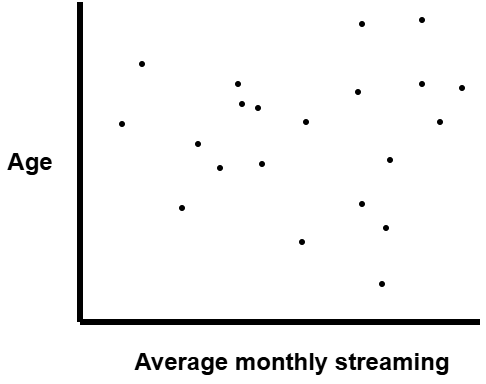
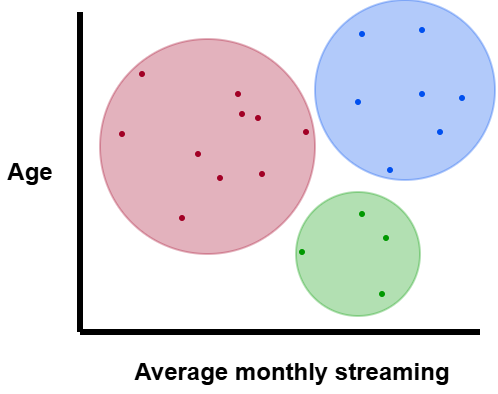

```{r}
#| echo: false
options(scipen = 0)
library(tidyverse)
library(openintro)
library(broom)
library(modelr)
theme_set(theme_bw(base_size = 22))
```

# Reviewing vocabulary

## Machine learning

**Machine learning** is a broad term for building models to analyze data, detect patterns, and make predictions.

- When you built linear or logistic regression models for prediction, that was machine learning
- *Linear regression was appropriate for what type of $Y$ variable?*
- *Logistic regression was appropriate for what type of $Y$ variable?*

## Variables

There are different ways people refer to the $X$ and $Y$ variables in regression:

| X | Y |
|:----------|:----------|
| Explanatory variable(s) | Response variable |
| Feature(s) | Target |
| Predictors | Outcome |
| Input | Output |


## Labeled data

When building predictive regression models we

1. Split the data into a training and a testing data set
2. Fit/estimated the model using the training data
3. Assess predictive performance using the testing data
  
. . .

We were working with **labeled data**, where we know the true target of interest $Y$ in our sample to train our model with

- This allowed us to compare true $Y$ values to predicted $Y$ values

## Supervised learning

**Supervised machine learning** is machine learning done with labeled data

Example motivation: 

- Training a model to predict heart disease by using past patient data for people with and without 
- Training a model to predict house sell price using recently sold housing data

Regression (linear and logistic) models are forms of supervised machine learning

## Unsupervised learning

**Unsupervised machine learning** is machine learning done with unlabeled data. 

- Aims to discover hidden patterns or relationships within the data without prior knowledge of the desired output (**unlabeled data**)

Examples: 

- Grouping genes with similar expression patterns to understand their functions
- Identifying the underlying themes or topics present in a collection of text documents, like news articles

# K-mean clustering

**K-means clustering** is an unsupervised machine learning method to split $n$ observations into $k$ clusters/groups, where each observation belongs to the cluster with the nearest mean

## K- means clustering example

Suppose a streaming service wants to understand its customer base better to tailor marketing. They want an algorithm to group customers based on the customer's streaming time and age.

::: {layout-ncol=2}



:::

## K-means clustering steps

You decide on $k$, the number of clusters/groups and the algorithm will:

2. Choose 3 random centers, starting points
3. Group each observation  with the center it is closest to
4. Calculate new centers based on clusters
5. Repeat steps 3-4 until not much is changing

## European country job markets 1979

- `Agr` - % of workforce employed in agriculture
- `Min` - % in mining
- `Man` - % in manufacturing
- `PS` - % in power supplies industries
- `Con` - % in construction
- `SI` - % in service industries
- `Fin` - % in finance
- `SPS` - % in social and personal services
- `TC` - % in transportation and communications

## European country job markets

```{r}
jobs <- read_csv(
  "http://csuci-data200.github.io/lectures/data/Eurojobs.csv",
  show_col_types = FALSE
)
glimpse(jobs)
```

## European country job markets

```{r}
set.seed(20251117)

clustered_jobs <- jobs |> 
  select(Agr, Min) |>  # I am using only 2 columns
  scale() |>  # Standardize data
  kmeans(centers = 2) # Cluster data

jobs |> 
  mutate(cluster = clustered_jobs$cluster)
```

##

```{r}
jobs |> 
  mutate(cluster = factor(clustered_jobs$cluster)) |> 
  ggplot(aes(x = Agr, y = Min, color = cluster)) +
  geom_point() +
  labs(x = "% in Agriculture", y = "% in Mining")
```


## 

Recall that the algorithm starts with random starting centers.

We can have the algorithm run multiple times with different starting centers, to find a better clustering.

- To do this we specify use the `nstart` argument

```{r}
clustered_jobs2 <- jobs |> 
  select(Agr, Min) |>  # I am using only 2 columns
  scale() |>  # Standardize data
  kmeans(centers = 2, nstart = 10) # Cluster data 10 times
```

##

```{r}
jobs |> 
  mutate(cluster = factor(clustered_jobs2$cluster)) |> 
  ggplot(aes(x = Agr, y = Min, color = cluster)) +
  geom_point() +
  labs(x = "% in Agriculture", y = "% in Mining")
```

## 

We chose 2 clusters ahead of time, what if we consider 3 clusters now?

```{r}
clustered_jobs3 <- jobs |> 
  select(Agr, Min) |>  # I am using only 2 columns
  scale() |>  # Standardize data
  kmeans(centers = 3, nstart = 10) # Cluster data 10 times
```


##

```{r}
jobs |> 
  mutate(cluster = factor(clustered_jobs3$cluster)) |> 
  ggplot(aes(x = Agr, y = Min, color = cluster, shape = cluster)) +
  geom_point() +
  labs(x = "% in Agriculture", y = "% in Mining")
```

## What is the "best" number of clusters?

```{r}
jobs |> 
  select(Agr, Min) |>  # I am using only 2 columns
  scale() |> 
  factoextra::fviz_nbclust(kmeans, method = "wss")
```

##

```{r}
#| echo: false

jobs |> 
  select(Agr, Min) |>  # I am using only 2 columns
  scale() |> 
  factoextra::fviz_nbclust(kmeans, method = "wss")
```

We want to balance better clustering (lower Total Sum of Squares) with number of clusters

It seems like after 3 clusters, behavior becomes relatively steady
